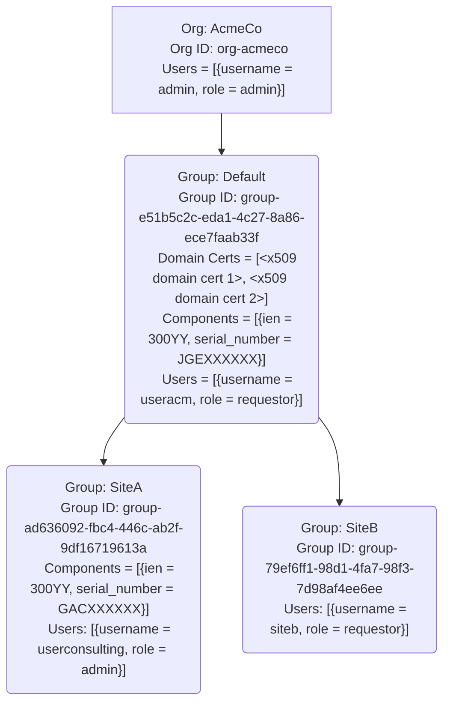
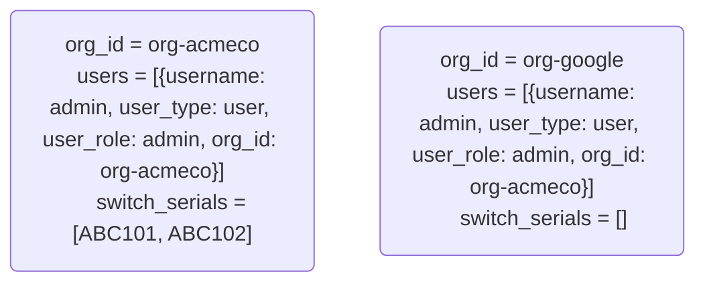
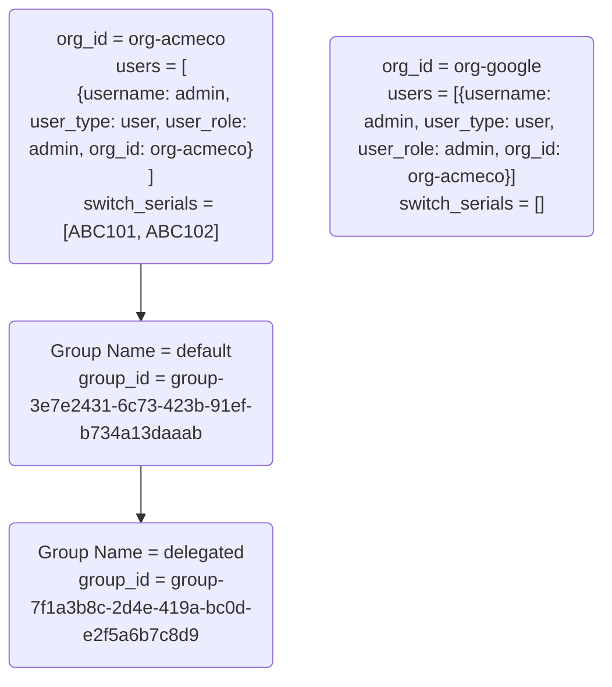
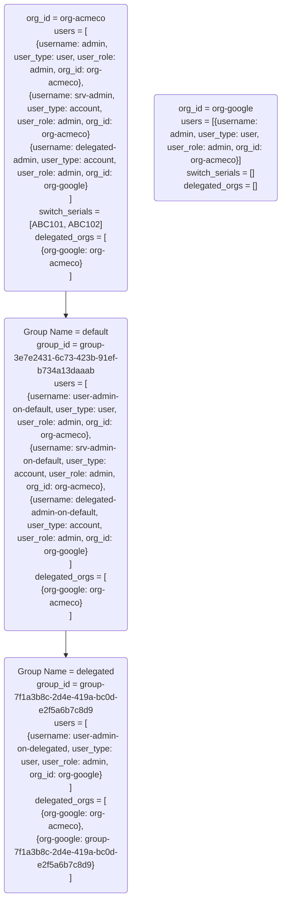

- [Ownership Voucher gRPC Service (ovgs)](#ownership-voucher-grpc-service-ovgs)
  - [Service Authentication and Authorization](#service-authentication-and-authorization)
    - [Authentication](#authentication)
    - [Authorization](#authorization)
  - [Serial Numbers](#serial-numbers)
  - [Pinned Domain Certificates (PDCs)](#pinned-domain-certificates-pdcs)
  - [Roles](#roles)
  - [Groups](#groups)
  - [Users](#users)
  - [Bootstrapping an Organization](#bootstrapping-an-organization)
  - [Cross-Org Group Delegation](#cross-org-group-delegation)
  - [GRPC APIs](#grpc-apis)
    - [/CreateGroup](#creategroup)
      - [Example Request](#example-request)
      - [Example Response](#example-response)
    - [/GetGroup](#getgroup)
      - [Example Request](#example-request-1)
      - [Example Response](#example-response-1)
    - [/DeleteGroup](#deletegroup)
      - [Example Request](#example-request-2)
    - [/AddGroupDelegatedOrg](#addgroupdelegatedorg)
      - [Example Request](#example-request-3)
    - [/DeleteGroupDelegatedOrg](#deletegroupdelegatedorg)
      - [Example Request](#example-request-4)
    - [/AddUserRole](#adduserrole)
      - [Example Request](#example-request-5)
    - [/RemoveUserRole](#removeuserrole)
      - [Example Request](#example-request-6)
    - [/GetUserRole](#getuserrole)
      - [Example Request](#example-request-7)
      - [Example Response](#example-response-2)
    - [/CreateDomainCert](#createdomaincert)
      - [Example Request](#example-request-8)
      - [Example Response](#example-response-3)
    - [/GetDomainCert](#getdomaincert)
      - [Example Request](#example-request-9)
      - [Example Response](#example-response-4)
    - [/DeleteDomainCert](#deletedomaincert)
      - [Example Request](#example-request-10)
    - [/AddSerial](#addserial)
      - [Example Request](#example-request-11)
    - [/RemoveSerial](#removeserial)
      - [Example Request](#example-request-12)
    - [/GetSerial](#getserial)
      - [Example Request](#example-request-13)
      - [Example Response](#example-response-5)
    - [/GetOwnershipVoucher](#getownershipvoucher)
      - [Example Request](#example-request-14)
      - [Example Response](#example-response-6)
  - [Service Use Examples](#service-use-examples)
    - [Setup](#setup)
      - [Install grpcurl](#install-grpcurl)
    - [Getting the Protobuf File](#getting-the-protobuf-file)
  - [User Workflow](#user-workflow)
    - [Getting the Token](#getting-the-token)
    - [Creating A New User](#creating-a-new-user)
    - [Creating a Group](#creating-a-group)
    - [Adding New Service Account to Organization Tree](#adding-new-service-account-to-organization-tree)
    - [Adding New User Account to Organization Tree](#adding-new-user-account-to-organization-tree)
    - [Adding a Delegated Org to the Group](#adding-a-delegated-org-to-the-group)
    - [Adding a Delegated User to the Group](#adding-a-delegated-user-to-the-group)
    - [Adding a Delegated User to the Group by Another Delegated User](#adding-a-delegated-user-to-the-group-by-another-delegated-user)
    - [Viewing Roles of A User](#viewing-roles-of-a-user)
    - [Adding A Pinned Domain Certificate](#adding-a-pinned-domain-certificate)
    - [Retrieving a Pinned Domain Cert](#retrieving-a-pinned-domain-cert)
    - [Getting All Serial Numbers](#getting-all-serial-numbers)
    - [Assigning A Serial Number to A Group](#assigning-a-serial-number-to-a-group)
    - [Getting Public Key of the TPM for A Serial Number (if applicable)](#getting-public-key-of-the-tpm-for-a-serial-number-if-applicable)
    - [Getting Details of A Group](#getting-details-of-a-group)
    - [Getting Ownership Voucher](#getting-ownership-voucher)
    - [Remove a User from a Group](#remove-a-user-from-a-group)
    - [Deleting A User or A Service Account](#deleting-a-user-or-a-service-account)
    - [Deleting A Serial Number from A Group](#deleting-a-serial-number-from-a-group)
    - [Deleting A Pinned Domain Cert](#deleting-a-pinned-domain-cert)
    - [Deleting A Delegated Org From a Group](#deleting-a-delegated-org-from-a-group)
    - [Deleting A Group](#deleting-a-group)
  - [Format of an Ownership Voucher](#format-of-an-ownership-voucher)

# Ownership Voucher gRPC Service (ovgs)

This document describes the interface to used to access the Ownership Voucher
(OV) gRPC Server. The OV gRPC server allows administrators to manage users and
devices within an organization and enables users to request [RFC8366 ownership
vouchers](https://datatracker.ietf.org/doc/html/rfc8366) for devices they have
been assigned. The system is designed around gRPC calls.

The purpose of this service is to allow users to request ownership vouchers for
network element components (as identified by their serial number + ien) owned by
their organization. Organizations are divided into subgroups, and serial numbers
for products and users are assigned to groups within the organization. The
sections on authentication and authorization provide more details on this.

## Service Authentication and Authorization

### Authentication

It is assumed that the vendor providing this service endpoint has a mechanism to
provide authentication for the service endpoint. The following examples assume
the use of an OIDC-based authentication environment.



### Authorization

The above figure shows the relationships between different entities in the
system. This is the organization tree. The root of the tree is the organization
itself. In this example, the organization has one child group, which has two
child groups. Each group has a set of pinned domain certs, a set of users, and a
set of serials assigned to it. This system has 3 roles: **ADMIN**, **ASSIGNER**,
and **REQUESTOR**. An **ADMIN** can do everything that an **ASSIGNER** can do.
An **ASSIGNER** can do everything a **REQUESTOR** can do.

Each user has access to the group that it belongs to along with all of its
children, i.e., the user has access to the subtree rooted at the group that the
user belongs to. One user can belong to multiple groups and access multiple
subtrees in the hierarchy. The user has the same permission across the subtree
that it has been assigned at the root group of the subtree. If two subtrees
overlap for a user, the permission that gives the user higher access is applied.

In the example shown in the figure, the user with `username=siteb` cannot request
an ownership voucher for the serial JGEXXXXXX because the serial belongs to the
parent group. The user with username=useracm can request an ownership voucher
for the serial with serial number GACXXXXXX because the user has access to the
parent group of the serial.

## Serial Numbers

Ownership vouchers can be issued for components as identified by their
serial number + ien (hereafter simply referred to as serial number, the
inclusion of an ien as appropriate, is implied). Some products may also have a
TPM Public Key associated with them. By default, it is assumed that all the
customer-owned component serial numbers are added to the root group by the
vendor as they are allocated. Users with the **ASSIGNER** or **ADMIN** role can
move/add serials within the tree from there. A serial can be assigned to a
single group apart from the root group. See the [`/GetSerial`](#getserial) RPC for an example
of the details available for a given serial number.

## Pinned Domain Certificates (PDCs)

Pinned Domain Certificates (aka PDCs) are the roots of trust used in the
ownership voucher, along with "revocation checks" and an "expiry time". A
certificate ID is returned when a pinned domain cert is added to a group. While
creating ownership vouchers, this cert ID is used to reference the certificate.
See the [`/GetDomainCert`](#getdomaincert) RPC for an example of this data.

## Roles

Users are assigned to **ADMIN** or **REQUSTER** or **ASSIGNER** roles. An
**ADMIN** can do everything that a (**ASSIGNER**, **REQUESTOR**) can do, along
with requesting Ownership Vouchers. See [`/GetGroup`](#getgroup) RPC for an example. Role
assignment has relevance within the context of a group and associated group
hierarchy.

A vendor may also maintain specific internal roles for performing
support-related operations. An **ADMIN** role can set up the group hierarchy and
add users with different roles for different subtrees. An **ASSIGNER** can
create PDCs and associate them with groups, move serials between groups, and
issue ownership vouchers. A **REQUESTOR** role allows read access and the
ability to issue ownership vouchers.

<table>
  <tr>
   <td><strong>Role</strong>
   </td>
   <td><strong>Allowed RPCs</strong>
   </td>
   <td><strong>Allowed to be Assigned / Removed by</strong>
   </td>
   <td><strong>Allowed to be Assigned on</strong>
   </td>
   <td><strong>Allowed to be Viewed by</strong>
   </td>
  </tr>
  <tr>
   <td>SUPPORT
   </td>
   <td>All RPCs. AddGroupDelegatedOrg and RemoveGroupDelegatedOrg can only be invoked by owner org ADMIN in root group.
   </td>
   <td>SUPPORT on the group/org or its parent
   </td>
   <td>the group/org or its children
   </td>
   <td>Anyone
   </td>
  </tr>
  <tr>
   <td>ADMIN
   </td>
   <td>All RPCs. AddGroupDelegatedOrg and RemoveGroupDelegatedOrg can only be invoked by owner org ADMIN in root group.
   </td>
   <td>SUPPORT / ADMIN on the group/org or its parent
   </td>
   <td>the group/org or its children
   </td>
   <td>Anyone
   </td>
  </tr>
  <tr>
   <td>ASSIGNER
   </td>
   <td>All except CreateGroup, DeleteGroup, AddUserRole, RemoveUserRole, AddGroupDelegatedOrg, RemoveGroupDelegatedOrg
   </td>
   <td>SUPPORT / ADMIN on the group/org or its parent
   </td>
   <td>the group/org or its children
   </td>
   <td>Anyone
   </td>
  </tr>
  <tr>
   <td>REQUESTOR
   </td>
   <td>GetGroup, GetUserRole, GetDomainCert, GetSerial, GetOwnershipVoucher
   </td>
   <td>SUPPORT / ADMIN / ASSIGNER on the group/org or its parent
   </td>
   <td>the group/org or its children
   </td>
   <td>Anyone
   </td>
  </tr>
</table>

## Groups

Groups are used to limit the scope of available data and allow for the members
of the group to manage a subset of items. Groups contain serials, domain certs,
users to roles assignments, and other groups as children. When an operator
begins using the ownership vouchers service, they will have a root group
created. Users can be assigned to more than one group and will have permission
to access their assigned and child groups. Child groups cannot access
information in their parent groups. A child can only have one parent in the
group hierarchy but can have multiple children. See the [`/GetGroup`](#getgroup) RPC for an
example of this data.

## Users

A user is uniquely identified using a combination of ID (username), type, and
the organization ID. The type of user supported today are either **USER** for a
SSO user, or **SERVICE_ACCOUNT** for a service account.

USER represents a user account, tied to their identity, as specified by the
authentication mechanism provided. SERVICE_ACCOUNT provides an identity that is
not tied to a human/user and is intended for programmatic access from any
app/service (say the bootstrap server) to the ovgs service. This can typically
be achieved by creating service accounts (with some name), and issuing long
lived tokens against that service account name.

## Bootstrapping an Organization

The process of bootstrapping an organization is expected to be vendor dependent
and is outside the scope of this service and document.

Note, it is assumed that the root group as defined by the vendor will have all
of operator's serial numbers assigned to it by default. Users then can modify
the assignment of the serials to different groups as needed.

## Cross-Org Group Delegation

A group can be delegated to another org by adding a user from the another org (called delegated org). To achieve this that org should be explicitly added to list of allowed delegated orgs of that group. See [`/AddGroupDelegatedOrg`](#addgroupdelegatedorg) for an example of achieving this. Only an **Owner Org ADMIN user in the root group** can invoke these RPCs.

Note: A delegated user will have restricted response based on different RPCs.

## GRPC APIs

Users can use the following endpoints to manipulate the devices, groups, users,
roles, and permissions. Further details on each method can be found within the
protobuf.

The examples below assume that the org is **AcmeCo** with Org ID **org-acmeco**. And there is another org **Google** with Org ID **org-google** which will be used for delegation.

### /CreateGroup

- **Endpoint:** `/CreateGroup`
- **Minimum Role Needed:** admin
- **Endpoint Action:** Creates a named group as a child of an existing group or
  an organization.

#### Example Request

```text
parent = org-acmeco
description = acmeco-bu
```

#### Example Response

```text
group_id = group-e51b5c2c-eda1-4c27-8a86-ece7faa0dac2
```

### /GetGroup

- **Endpoint:** `/GetGroup`
- **Minimum Role Needed:** requestor
- **Endpoint Action:** For a named group, view the child groups, domain-certs
  IDs, serials and user/role mappings for that group.

#### Example Request

```text
group_id = group-e51b5c2c-eda1-4c27-8a86-ece7faa0dac2
```

#### Example Response

```text
group_id = group-e51b5c2c-eda1-4c27-8a86-ece7faa0dac2
cert_ids = [cert-7ccce4fc-1b28-469a-b4f5-79a4115d772b, ]
components = [{ien = 300XX, serial_number = JPEXXXX076}]
users = [{username = useracm, user_type = USER, org_id = org-acmeco, user_role = USER_ROLE_ADMIN}]
delegated_orgs = []
```

### /DeleteGroup

- **Endpoint:** `/DeleteGroup`
- **Minimum Role Needed:** admin
- **Endpoint Action:** Deletes a named group. Will refuse to do so if there are
  subgroups.

#### Example Request

```text
group_id = group-e51b5c2c-eda1-4c27-8a86-ece7faa0dac2
```

### /AddGroupDelegatedOrg

- **Endpoint:** `/AddGroupDelegatedOrg`
- **Minimum Role Needed:** owner org admin in root group
- **Endpoint Action:** For a named group, add an org to the list of orgs for which the group delegation is allowed.

#### Example Request

```text
group_id = group-e51b5c2c-eda1-4c27-8a86-ece7faa0dac2
org_id = org-google
```

### /DeleteGroupDelegatedOrg

- **Endpoint:** `/RemoveGroupDelegatedOrg`
- **Minimum Role Needed:** owner org admin in root group
- **Endpoint Action:** For a named group, removes an org from the list of orgs for which the group delegation is allowed.

#### Example Request

```text
group_id = group-e51b5c2c-eda1-4c27-8a86-ece7faa0dac2
org_id = org-google
```

### /AddUserRole

- **Endpoint:** `/AddUserRole`
- **Minimum Role Needed:** admin
- **Endpoint Action:** Assigns a user to a role in a named group.

#### Example Request

```text
username = useracm
user_type = USER
org_id = org-acmeco
group_id = group-e51b5c2c-eda1-4c27-8a86-ece7faa0dac2
user_role = USER_ROLE_REQUESTOR
```

### /RemoveUserRole

- **Endpoint:** `/RemoveUserRole`
- **Minimum Role Needed:** admin
- **Endpoint Action:** Removes the role of the user in a named group. This
  essentially revokes a user’s access to the group.

#### Example Request

```text
username = useracm
user_type = USER
org_id = org-acmeco
group_id = group-e51b5c2c-eda1-4c27-8a86-ece7faa0dac2
```

### /GetUserRole

- **Endpoint:** `/GetUserRole`
- **Minimum Role Needed:** requestor
- **Endpoint Action:** For a given user, returns the permissions of the user
  across groups that it belongs to. A user can only view roles of another user
  in the groups that it has a role assigned to.

#### Example Request

```text
username = useracm
user_type = user
org_id = org-acmeco
```

#### Example Response

```text
groups = [{ group-e51b5c2c-eda1-4c27-8a86-ece7faa0dac2 = ADMIN}]
```

### /CreateDomainCert

- **Endpoint:** `/CreateDomainCert`
- **Minimum Role Needed:** assigner
- **Endpoint Action:** For a named group, set the values of:
    - Pinned-domain-cert
    - Domain-cert-revocation-checks
    - Expiry Time

#### Example Request

```text
group_id = group-e51b5c2c-eda1-4c27-8a86-ece7faa0dac2
certificate_der = <x509 cert ASN.1 der encoded>
revocation_checks = true
expiry_time = 2023-02-25T00:00:00.000Z
```

#### Example Response

```text
cert_id = cert-7ccce4fc-1b28-469a-b4f5-79a4115d772b
```

### /GetDomainCert

- **Endpoint:** `/GetDomainCert`
- **Minimum Role Needed:** requestor
- **Endpoint Action:** For a given domain cert id reveals the values of:
    - `group_id` that the cert belongs to
    - Pinned-domain-cert
    - Domain-cert-revocation-checks
    - `expiry_time`

#### Example Request

```text
cert_id = cert-7ccce4fc-1b28-469a-b4f5-79a4115d772b
```

#### Example Response

```text
group_id = group-e51b5c2c-eda1-4c27-8a86-ece7faa0dac2
certificate_der = <x509 ASN.1 der encoded>
revocation_checks = true
expiry_time = 2023-02-25T00:00:00.000Z
```

### /DeleteDomainCert

- **Endpoint:** `/DeleteDomainCert`
- **Minimum Role Needed:** assigner
- **Endpoint Action:** For a given cert_id, delete the cert from the database.

#### Example Request

```text
cert_id = cert-7ccce4fc-1b28-469a-b4f5-79a4115d772b
```

### /AddSerial

- **Endpoint:** `/AddSerial`
- **Minimum Role Needed:** assigner
- **Endpoint Action:** For a serial and named group, assign the serial to that group.

#### Example Request

```text
component = {ien = 300YY, serial_number = JPEXXXX1076}
group_id = group-e51b5c2c-eda1-4c27-8a86-ece7faa0dac2
```

### /RemoveSerial

- **Endpoint:** `/RemoveSerial`
- **Minimum Role Needed:** assigner
- **Endpoint Action:** For a serial and named group, remove the serial from the group.

#### Example Request

```text
component = {ien = 300YY, serial_number = JPEXXXX1076}
group_id = group-e51b5c2c-eda1-4c27-8a86-ece7faa0dac2
```

### /GetSerial

- **Endpoint:** `/GetSerial`
- **Minimum Role Needed:** requestor
- **Endpoint Action:** Given a serial number, return all the facts about the serial.

#### Example Request

```text
component = {ien = 300YY, serial_number = JPEXXXX1076}
```

#### Example Response

```text
public_key_der = <TPM public key, ASN.1 der encoded (if applicable for this part)>
group_ids = [group-e51b5c2c-eda1-4c27-8a86-ece7faa0dac2]
mac_addr = 00:00:5e:00:53:af
model = DCS-7800-SUP
tpm_info = {
  endorsement_key = <Public component of TPM's endorsement key, ASN.1 der encoded (if applicable for this part)>
}
```

**Note**: `public_key_der` is deprecated and will be removed in favor of `tpm_info`

### /GetOwnershipVoucher

- **Endpoint:** `/GetOwnershipVoucher`
- **Minimum Role Needed:** requestor
- **Endpoint Action:** Given a Serial Number, Domain Cert ID, IEN (IANA
  Enterprise Number of the device vendor, e.g., 30065 is Arista’s IEN) and OV
  lifetime this endpoint will do the following:
    - Verify that the requestor has access to the device with the serial number.
    - Verify that the requested lifetime in not in the past and is within the cert
      expiry time
    - Issue an OV with the requested and set parameters.
    - Also return the TPM public key of the device for downstream validation or
      other purposes if available.
    - The TPM public key is not required to be used, but allows the customer to
      perform additional in-depth validations of the product they receive.

#### Example Request

```text
component = {ien = 300YY, serial_number = JPE29451076}
cert_id = cert-7ccce4fc-1b28-469a-b4f5-79a4115d772b
lifetime = 2023-02-25T00:00:00.000Z
```

#### Example Response

```text
voucher_cms = <voucher, example below>
public_key_der = <switch TPM public key, ASN.1 der encoded, example below>
tpm_info = {
  ek_certificate = <DER encoded X.509 certificate of the endorsement key (if applicable for this part)>
  platform_primary_key = <Public component of platform primary key, ASN.1 der encoded (if applicable for this part)>
}
```

**Note**: `public_key_der` is deprecated and will be removed in favor of `tpm_info`

## Service Use Examples

The following examples assume the organization has been bootstrapped by the
vendor and an `admin` user has been created.

Once the admin user has logged in and specified their username, they shall be
added with the role **ADMIN** to the root of the organization tree.

It is recommended that the admin user create a service account, give it an ADMIN
role over the organization and tree, and then use the service account for
interacting with the ownership voucher service programmatically, including
setting up their organization tree. The organization **acmeco** and **google** will be used for the
examples below.

The following tree is a set up when baseline organizations or tenants are created for the respective operators. For example, these nodes are set up for the `acmeco` and `google` organization with an admin user.



### Setup

#### Install grpcurl

`grpcurl` can be either compiled from the source code available on Github or
binaries can be directly downloaded from
<https://github.com/fullstorydev/grpcurl/releases>.

Subsequent examples use `grpcurl`, where the fields are encoded in JSON.

### Getting the Protobuf File

The protobuf file can be found in the following github repository:
<https://github.com/openconfig/ovgs/>

## User Workflow

The operator will need to use both their vendor-specific UI and the `grpcurl`
tool (or something equivalent) to interact with the Ownership Voucher Grpc
service and perform necessary operations to get access to the vouchers, as
explained below.

### Getting the Token

Obtaining an API access token will be a function of the mechanisms provided by the
respective vendor. Review your vendor's documentation for the relevant details.

### Creating A New User

To create a new user or service account, follow the steps provided by the vendor
for interaction with their respective account management processes.

### Creating a Group

Create a group with the name `default` as a child to the root group in `org-acmeco`. Copy the group ID from the response, this will be required later.

```shell
$ ACCESS_TOKEN=<token of admin>
$ grpcurl -H "Cookie: access_token=${ACCESS_TOKEN}"         \
    -proto ovgs.proto                                       \
    -d '{"parent": "org-acmeco", "description": "default"}' \
    www.a-network-vendor.io:443                             \
    ovgs.v1.OwnershipVoucherService/CreateGroup
```

<h4>Response</h4>

```text
{"group_id": "group-3e7e2431-6c73-423b-91ef-b734a13daaab"}
```

Let's also create a group with the name `delegated` as a child to the `default` group in `org-acmeco`

The organization tree is now structured as follows:



### Adding New Service Account to Organization Tree

To add the `srv-admin` service account to the organization tree add the service
account to the root of the organization tree. Notice that the following is set:

1. The username is set to `srv-admin`
2. `user_type` as `ACCOUNT_TYPE_SERVICE_ACCOUNT` (`ACCOUNT_TYPE_USER` for user
   accounts, `ACCOUNT_TYPE_SERVICE_ACCOUNT` for service accounts)
3. `org_id` is `org-acmeco`
4. `group_id` is same as `org_id` because the account is assigned to the root group
5. user_role is set to `USER_ROLE_ADMIN`

```shell
$ ACCESS_TOKEN=<token of admin>
$ grpcurl -H "Cookie: access_token=${ACCESS_TOKEN}" \
    -proto ovgs.proto                               \
    -d '{"username": "srv-admin", "user_type": "ACCOUNT_TYPE_SERVICE_ACCOUNT", "org_id": "org-acmeco", "group_id": "org-acmeco", "user_role": "USER_ROLE_ADMIN"}' \
  www.a-network-vendor.io:443                       \
  ovgs.v1.OwnershipVoucherService/AddUserRole
```

<h4>Response</h4>

```text
{}
```

Once this command is executed successfully, the user is added to the root group

### Adding New User Account to Organization Tree

To add the `user-admin-on-default` user account to our
organization tree add this user account to the group named `default`. Notice
that the following are set:

1. The username to `user-admin-on-default`
2. user_type as `ACCOUNT_TYPE_USER` (`ACCOUNT_TYPE_USER` for user accounts,
   `ACCOUNT_TYPE_SERVICE_ACCOUNT` for service accounts)
3. `org_id` to `org-acmeco`
4. `group_id` to `group-3e7e2431-6c73-423b-91ef-b734a13daaab`, that is the group
   ID of the `default` group
5. user_role to set to `USER_ROLE_ADMIN`

```shell
$ ACCESS_TOKEN=<token of srv-admin>
$ grpcurl -H "Cookie: access_token=${ACCESS_TOKEN}" \
    -proto ovgs.proto                               \
    -d '{"username": "user-admin-on-default", "user_type": "ACCOUNT_TYPE_USER", "org_id": "org-acmeco", "group_id": "group-3e7e2431-6c73-423b-91ef-b734a13daaab", "user_role": "ADMIN"}' \
    www.a-network-vendor.io:443                     \
    ovgs.v1.OwnershipVoucherService/AddUserRole
```

<h4>Response</h4>

```text
{}
```

Once this command is executed successfully, the user is added to the "default"
group.

Similarly, we can create a service account `srv-admin-on-default` and add it to the `default` group.

### Adding a Delegated Org to the Group

Let's add org `google` to the list of orgs which are allowed delegation over the `delegated` group.

Note: Only the owner org admins in the root group i.e. users `admin` and `srv-admin` can invoke this

```shell
$ ACCESS_TOKEN=<token of srv-admin>
$ grpcurl -H "Cookie: access_token=${ACCESS_TOKEN}" \
    -proto ovgs.proto                               \
    -d '{"group_id": "group-7f1a3b8c-2d4e-419a-bc0d-e2f5a6b7c8d9", "org_id": "org-google"}' \
    www.a-network-vendor.io:443                     \
    ovgs.v1.OwnershipVoucherService/AddGroupDelegatedOrg
```

<h4>Response</h4>

```text
{}
```

### Adding a Delegated User to the Group

Let's add a delegated user `user-admin-on-delegated` from org `google` to the `delegated` group. This can be done by any user which has the required permissions over this group. Notice: the access token of `user-admin-on-default` is used this time.

```shell
$ ACCESS_TOKEN=<token of user-admin-on-default>
$ grpcurl -H "Cookie: access_token=${ACCESS_TOKEN}" \
    -proto ovgs.proto                               \
    -d '{"username": "user-admin-on-delegated", "user_type": "ACCOUNT_TYPE_USER", "org_id": "org-google", "group_id": "group-7f1a3b8c-2d4e-419a-bc0d-e2f5a6b7c8d9", "user_role": "ADMIN"}' \
    www.a-network-vendor.io:443                     \
    ovgs.v1.OwnershipVoucherService/AddUserRole
```

<h4>Response</h4>

```text
{}
```

Let's also add `google` to list of delegated org in the root group `org-acmeco` and add another delegated user `delegated-admin` on the root group `org-acmeco` from `org-google`.

### Adding a Delegated User to the Group by Another Delegated User

A delegated user can only add new user roles from its own org.

Let's add a delegated user `delegated-admin-on-default` from org `google` to the `default` group by using access token of the user `delegated-admin`.

```shell
$ ACCESS_TOKEN=<token of delegated-admin>
$ grpcurl -H "Cookie: access_token=${ACCESS_TOKEN}" \
    -proto ovgs.proto                               \
    -d '{"username": "delegated-admin-on-default", "user_type": "ACCOUNT_TYPE_USER", "org_id": "org-google", "group_id": "group-3e7e2431-6c73-423b-91ef-b734a13daaab", "user_role": "ADMIN"}' \
    www.a-network-vendor.io:443                     \
    ovgs.v1.OwnershipVoucherService/AddUserRole
```

<h4>Response</h4>

```text
{}
```

The organization tree is now structured as follows:



### Viewing Roles of A User

Let’s try to view the roles of the srv-admin user. Here when using the access
token of the srv-admin user, the following response is seen:

```shell
$ ACCESS_TOKEN=<token of srv-admin>
$ grpcurl -H "Cookie: access_token=${ACCESS_TOKEN}" \
    -proto ovgs.proto                               \
    -d '{"username": "srv-admin", "user_type": "ACCOUNT_TYPE_SERVICE_ACCOUNT", "org_id": "org-acmeco"}' \
    www.a-network-vendor.io:443                     \
    ovgs.v1.OwnershipVoucherService/GetUserRole
```

<h4>Response</h4>

```text
{"groups": {"org-acmeco": "ADMIN"}}
```

Now, if the access token of srv-admin-on-default is used, no roles will be seen.

```shell
$ ACCESS_TOKEN=<token of srv-admin-on-default>
$ grpcurl -H "Cookie: access_token=${ACCESS_TOKEN}" \
    -proto ovgs.proto                               \
   -d '{"username": "srv-admin", "user_type": "ACCOUNT_TYPE_SERVICE_ACCOUNT", "org_id": "org-acmeco"}' \
   www.a-network-vendor.io:443                      \
 ovgs.v1.OwnershipVoucherService/GetUserRole
```

<h4>Response</h4>

```text
{"groups": {}}
```

Now, if a delegated caller wants to view roles of a user from it's own org, the following response is seen.

```shell
$ ACCESS_TOKEN=<token of delegated-admin>
$ grpcurl -H "Cookie: access_token=${ACCESS_TOKEN}" \
    -proto ovgs.proto                               \
    -d '{"username": "user-admin-on-delegated", "user_type": "ACCOUNT_TYPE_USER", "org_id": "org-google"}' \
    www.a-network-vendor.io:443                     \
    ovgs.v1.OwnershipVoucherService/GetUserRole
```

<h4>Response</h4>

```text
{"groups": {"delegated": "ADMIN"}}
```

A delegated caller can not view the roles a user from different org.

```shell
$ ACCESS_TOKEN=<token of delegated-admin>
$ grpcurl -H "Cookie: access_token=${ACCESS_TOKEN}" \
    -proto ovgs.proto                               \
    -d '{"username": "user-admin-on-default", "user_type": "ACCOUNT_TYPE_USER", "org_id": "org-acmeco"}' \
    www.a-network-vendor.io:443                     \
    ovgs.v1.OwnershipVoucherService/GetUserRole
```

<h4>Response</h4>

```text
{"groups": {}}
```

### Adding A Pinned Domain Certificate

```shell
 ACCESS_TOKEN=<token of srv-admin-on-default>
$ grpcurl -H "Cookie: access_token=${ACCESS_TOKEN}" \
    -proto ovgs.proto                               \
    -d '{"group_id": "group-3e7e2431-6c73-423b-91ef-b734a13daaab", "certificate_der": "MIIHRzCCss { ... snipped ... } OEGsiDoRSlA==", "revocation_checks": true, "expiry_time": "2023-02-25T00:00:00.000Z"}' \
    www.a-network-vendor.io:443                     \
    ovgs.v1.OwnershipVoucherService/CreateDomainCert
```

<h4>Response</h4>

```text
{"cert_id": "cert-29466354-a669-4c47-91cf-f214c03626db"}
```

### Retrieving a Pinned Domain Cert

```shell
$ ACCESS_TOKEN=<token of srv-admin-on-default>
$ grpcurl -H "Cookie: access_token=${ACCESS_TOKEN}"             \
  -proto ovgs.proto                                             \
  -d '{"cert_id": "cert-29466354-a669-4c47-91cf-f214c03626db"}' \
  www.a-network-vendor.io:443                                   \
  ovgs.v1.OwnershipVoucherService/GetDomainCert
```

<h4>Response</h4>

```text
{
  "cert_id": "cert-29466354-a669-4c47-91cf-f214c03626db",
  "group_id": "group-3e7e2431-6c73-423b-91ef-b734a13daaab",
  "certificate_der": "MIIHRzCCBi+gAwIB...I6dj87VD+laMUBd7HBtOEGsiDoRSlA==",
  "revocation_checks": true,
  "expiry_time": "2023-02-25T00:00:00.000Z"
}
```

### Getting All Serial Numbers

The operator can use the `/GetGroup` RPC with `group_id` set to the `org_id`. For
example, if `acmeco` wants to get all of their serial numbers that they own and
their `org_id` is `org-acmeco`, they can run:

```shell
$ ACCESS_TOKEN=<token of srv-admin>
$ grpcurl -H "Cookie: access_token=${ACCESS_TOKEN}" \
    -proto ovgs.proto                               \
    -d '{"group_id": "org-acmeco"}'                 \
    www.a-network-vendor.io:443                     \
    ovgs.v1.OwnershipVoucherService/GetGroup
```

<h4>Response</h4>

```text
{
  "components": [
    {
      "ien": "30065",
      "serialNumber": "ABC101"
    },
    {
      "ien": "30065",
      "serialNumber": "ABC102"
    }
  ],
  "users": [
    {
      "username": "admin",
      "user_type": "ACCOUNT_TYPE_USER",
      "org_id": "org-acmeco",
      "user_role": "USER_ROLE_ADMIN"
    },
    {
      "username": "srv-admin",
      "user_type": "ACCOUNT_TYPE_SERVICE_ACCOUNT",
      "org_id": "org-acmeco",
      "user_role": "USER_ROLE_ADMIN"
    },
    {
      "username": "delegated-admin",
      "user_type": "ACCOUNT_TYPE_USER",
      "org_id": "org-google",
      "user_role": "USER_ROLE_ADMIN"
    },
  ],
  "delegated_orgs": {
    "org-google": "org-acmeco"
  },
  "child_group_ids": [ "group-3e7e2431-6c73-423b-91ef-b734a13daaab"]
  ...
}
```

### Assigning A Serial Number to A Group

A serial is always assigned to the root group.

If a serial was already assigned to a group (other than the root group) before, it will be unassigned from the group and reassigned to the new group mentioned in the request.

```shell
$ ACCESS_TOKEN=<token of srv-admin>
$ grpcurl -H "Cookie: access_token=${ACCESS_TOKEN}"               \
    -proto ovgs.proto                                             \
    -d '{"component": {"ien": "30065","serial_number": "ABC101"}, \
    "group_id": "group-3e7e2431-6c73-423b-91ef-b734a13daaab"}'    \
    www.a-network-vendor.io:443                                   \
    ovgs.v1.OwnershipVoucherService/AddSerial
```

<h4>Response</h4>

```text
{}
```

### Getting Public Key of the TPM for A Serial Number (if applicable)

```shell
$ ACCESS_TOKEN=<token of srv-admin>
$ grpcurl -H "Cookie: access_token=${ACCESS_TOKEN}" 		   \
    -proto ovgs.proto                               		   \
    -d '{"component": {"ien": "30065","serial_number": "ABC101"}}' \
    www.a-network-vendor.io:443                     		   \
    ovgs.v1.OwnershipVoucherService/GetSerial
```

<h4>Response</h4>

```text
{
  "public_key_der": "MIIBIjANBgkqhkiG9w0BA...A4M3QIDAQAB",
  "tpm_info": {
    "endorsement_key": "MIIBIjANBgkqhkiG9w0BA...A4M3QIDAQAB"
  },
  "group_ids": [ "group-3e7e2431-6c73-423b-91ef-b734a13daaab", "org-acmeco" ],
  "mac_addr": "00:00:5e:00:53:af",
  "model": "DCS-7800-SUP"
}
```

### Getting Details of A Group

```shell
$ ACCESS_TOKEN=<token of srv-admin-on-default>
$ grpcurl -H "Cookie: access_token=${ACCESS_TOKEN}"                 \
    -proto ovgs.proto                                               \
    -d '{"group_id": "group-3e7e2431-6c73-423b-91ef-b734a13daaab"}' \
    www.a-network-vendor.io:443                                     \
    ovgs.v1.OwnershipVoucherService/GetGroup

```

<h4>Response</h4>

```text
{
  "group_id": "group-3e7e2431-6c73-423b-91ef-b734a13daaab",,
  "cert_ids": [ "cert-29466354-a669-4c47-91cf-f214c03626db" ],
  "components": [
    {
      "ien": "30065",
      "serialNumber": "ABC101"
    }
  ],
  "users": [
    {
      "username": "srv-admin-on-default",
      "user_type": "ACCOUNT_TYPE_SERVICE_ACCOUNT",
      "org_id": "org-acmeco",
      "user_role": "USER_ROLE_ADMIN"
    },
    {
      "username": "user-admin-on-default",
      "user_type": "ACCOUNT_TYPE_SERVICE_ACCOUNT",
      "org_id": "org-acmeco",
      "user_role": "USER_ROLE_ADMIN"
    },
    {
      "username": "delegated-admin-on-default",
      "user_type": "ACCOUNT_TYPE_USER",
      "org_id": "org-google",
      "user_role": "USER_ROLE_ADMIN"
    }
  ],
  "delegated_orgs": {
    "org-google": "org-acmeco"
  },
  "child_group_ids": [ "group-7f1a3b8c-2d4e-419a-bc0d-e2f5a6b7c8d9" ]
}
```

A delegated user will only be able to see the users in its org.

```shell
$ ACCESS_TOKEN=<token of delegated-admin-on-default>
$ grpcurl -H "Cookie: access_token=${ACCESS_TOKEN}"                 \
    -proto ovgs.proto                                               \
    -d '{"group_id": "group-7f1a3b8c-2d4e-419a-bc0d-e2f5a6b7c8d9"}' \
    www.a-network-vendor.io:443                                     \
    ovgs.v1.OwnershipVoucherService/GetGroup

```

<h4>Response</h4>

```text
{
  "group_id": "group-7f1a3b8c-2d4e-419a-bc0d-e2f5a6b7c8d9",,
  "cert_ids": [],
  "components": [],
  "users": [
    {
      "username": "user-admin-on-delegated",
      "user_type": "ACCOUNT_TYPE_USER",
      "org_id": "org-google",
      "user_role": "USER_ROLE_ADMIN"
    }
  ],
  "delegated_orgs": {
    "org-google": "org-acmeco",
    "org-google": "group-7f1a3b8c-2d4e-419a-bc0d-e2f5a6b7c8d9"
  },
  "child_group_ids": []
}
```

### Getting Ownership Voucher

The org of the cert and serial should be the same.

```shell
$ ACCESS_TOKEN=<token of srv-admin-on-default>
$ grpcurl -H "Cookie: access_token=${ACCESS_TOKEN}"               \
    -proto ovgs.proto                                             \
    -d '{"component": {"ien": "30065","serial_number": "ABC101"}, "cert_id": "cert-29466354-a669-4c47-91cf-f214c03626db", "lifetime": "2023-02-25T00:00:00.000Z"}' \
    www.a-network-vendor.io:443                                   \
    ovgs.v1.OwnershipVoucherService/GetOwnershipVoucher
```

<h4>Response</h4>

```text
{
  "voucher_cms": "MIIeYAYJKoZI...XyC/dx8DbRGBWKK/pcGG+U50PRt86Q==",
  "public_key_der": "MIIBIjANBg...BVdgA4M3QIDAQAB",
  "tpm_info": {
    "ek_certificate": "308202413082...cacbcccdcecf",
    "platform_primary_key": "3039301306...bc1144e2",
  }
}
```

Note that every time a voucher is requested for a device with the same PDC and
lifetime, a different voucher is generated. All of the vouchers are valid
vouchers.

### Remove a User from a Group

```shell
$ ACCESS_TOKEN=<token of srv-admin>
$ grpcurl -H "Cookie: access_token=${ACCESS_TOKEN}"               \
    -proto ovgs.proto                                             \
    -d '{"username": "user-admin-on-default",                     \
       "user_type": "ACCOUNT_TYPE_USER",                          \
       "org_id": "org-acmeco",                                    \
       "group_id": "group-3e7e2431-6c73-423b-91ef-b734a13daaab"}' \
    www.a-network-vendor.io:443                                   \
    ovgs.v1.OwnershipVoucherService/RemoveUserRole
```

<h4>Response</h4>

```text
{}
```

A delegated caller can only delete delegated users from its org.

```shell
$ ACCESS_TOKEN=<token of delegated-admin>
$ grpcurl -H "Cookie: access_token=${ACCESS_TOKEN}"               \
    -proto ovgs.proto                                             \
    -d '{"username": "user-admin-on-delegated",                   \
       "user_type": "ACCOUNT_TYPE_USER",                          \
       "org_id": "org-google",                                    \
       "group_id": "group-7f1a3b8c-2d4e-419a-bc0d-e2f5a6b7c8d9"}' \
    www.a-network-vendor.io:443                                   \
    ovgs.v1.OwnershipVoucherService/RemoveUserRole
```

<h4>Response</h4>

```text
{}
```

### Deleting A User or A Service Account

Deletion of a user or a service account is handled through the mechanisms
provided by the vendor's user management interface.

### Deleting A Serial Number from A Group

```shell
$ ACCESS_TOKEN=<token of srv-admin-on-default>
$ grpcurl -H "Cookie: access_token=${ACCESS_TOKEN}"               \
    -proto ovgs.proto                                             \
    -d '{"component": {"ien": "30065","serial_number": "ABC101"}, \
    "group_id": "group-3e7e2431-6c73-423b-91ef-b734a13daaab"}'    \
    www.a-network-vendor.io:443                                   \
    ovgs.v1.OwnershipVoucherService/RemoveSerial
```

<h4>Response</h4>

```text
{}
```

### Deleting A Pinned Domain Cert

```shell
$ ACCESS_TOKEN=<token of srv-admin-on-default>
$ grpcurl -H "Cookie: access_token=${ACCESS_TOKEN}"               \
    -proto ovgs.proto                                             \
    -d '{"cert_id": "cert-29466354-a669-4c47-91cf-f214c03626db"}' \
    www.a-network-vendor.io:443                                   \
    ovgs.v1.OwnershipVoucherService/DeleteDomainCert
```

<h4>Response</h4>

```text
{}
```

### Deleting A Delegated Org From a Group

All the delegated users from this org must be deleted from all the groups and sub-groups for which this group is the only group which enabled delegation for this org.

Note: This can only be invoked by an admin of the root group of the owner org.

```shell
$ ACCESS_TOKEN=<token of srv-admin>
$ grpcurl -H "Cookie: access_token=${ACCESS_TOKEN}"                \
    -proto ovgs.proto                                              \
    -d '{"group_id": "group-7f1a3b8c-2d4e-419a-bc0d-e2f5a6b7c8d9", \
    "org_id": "org-google"}'                                       \
    www.a-network-vendor.io:443                                    \
    ovgs.v1.OwnershipVoucherService/RemoveGroupDelegatedOrg
```

<h4>Response</h4>

```text
{}
```

### Deleting A Group

Deleting a group is only allowed when there are no objects such as certificates,
device serials, children groups, and users associated with the group.

```shell
$ ACCESS_TOKEN=<token of admin>
$ grpcurl -H "Cookie: access_token=${ACCESS_TOKEN}"               \
-proto ovgs.proto                                                 \
  -d '{"group_id": "group-7f1a3b8c-2d4e-419a-bc0d-e2f5a6b7c8d9"}' \
  www.a-network-vendor.io:443                                     \
  ovgs.v1.OwnershipVoucherService/DeleteGroup
```

<h4>Response</h4>

```text
{}
```

## Format of an Ownership Voucher

More details are available at [RFC8366
Section-5.3](https://tools.ietf.org/html/rfc8366#section-5.3).

- `created-on` and `expires-on` follow RFC3339 format
- `expires-on` is omitted if the certificate is not expected to expire.
- `pinned-domain-cert` is ASN.1 DER encoded x509 certificate converted into
  string using the base64 encoding
- `domain-cert-revocation-checks` is going to be a boolean value

```text
{
  "ietf-voucher:voucher": {
        "created-on": "2023302-11T13:45:31.69401473+05:30",
        "expires-on": "2023-08-11T13:45:31+05:30",
        "serial-number": "JPEXXXX27",
        "assertion": "verified",
        "pinned-domain-cert": "MIIFjjC {... snipped ...} HBUoCj0M6oIjhTcvHQ==",
        "domain-cert-revocation-checks": true
  }
}
```

The ownership voucher is signed and provided in binary CMS format as explained
in [rfc8366](https://tools.ietf.org/html/rfc8366) Note that the ownership
vouchers are not encrypted, only signed by the vendor.
